### Escuela Colombiana de Ingeniería
### Arquitecturas de Software - ARSW
### Laboratorio - Broker de Mensajes STOMP con WebSockets + HTML5 Canvas.
## Santiago Arévalo Rojas
## Juan Felipe Sánchez Pérez


- Conectarse con un botón
- publicar con eventos de mouse

var newpoint = JSON.parse(greeting.body);
                addPointToCanvas(newpoint);


stompClient.send("/topic/newpoint", {}, JSON.stringify(pt));  				


Este ejercicio se basa en la documentación oficial de SprinbBoot, para el [manejo de WebSockets con STOMP](https://spring.io/guides/gs/messaging-stomp-websocket/).

En este repositorio se encuentra una aplicación SpringBoot que está configurado como Broker de mensajes, de forma similar a lo mostrado en la siguiente figura:


En este caso, el manejador de mensajes asociado a "/app" aún no está configurado, pero sí lo está el broker '/topic'. Como mensaje, se usarán puntos, pues se espera que esta aplicación permita progragar eventos de dibujo de puntos generados por los diferentes clientes.

## Parte I.

Para las partes I y II, usted va a implementar una herramienta de dibujo colaborativo Web, basada en el siguiente diagrama de actividades:


Para esto, realice lo siguiente:

1. __Haga que la aplicación HTML5/JS al ingresarle en los campos de X y Y, además de graficarlos, los publique en el tópico: /topic/newpoint . Para esto tenga en cuenta (1) usar el cliente STOMP creado en el módulo de JavaScript y (2) enviar la representación textual del objeto JSON (usar JSON.stringify). Por ejemplo:__

	```javascript
	//creando un objeto literal
	stompClient.send("/topic/newpoint", {}, JSON.stringify({x:10,y:10}));
	```

	```javascript
	//enviando un objeto creado a partir de una clase
	stompClient.send("/topic/newpoint", {}, JSON.stringify(pt)); 
	```
	Luego de enviar el objeto al tópico, evidenciamos en la consola que efectivamente se realizó de manera correcta, donde podemos ver el SEND y el topic de destino:  
	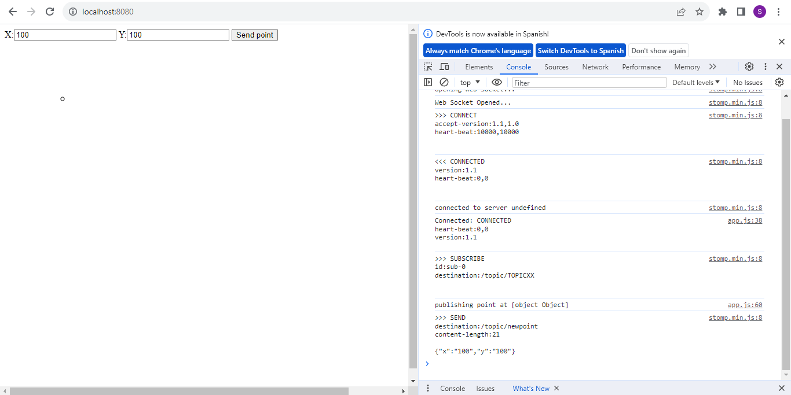

2. __Dentro del módulo JavaScript modifique la función de conexión/suscripción al WebSocket, para que la aplicación se suscriba al tópico "/topic/newpoint" (en lugar del tópico /TOPICOXX). Asocie como 'callback' de este suscriptor una función que muestre en un mensaje de alerta (alert()) el evento recibido. Como se sabe que en el tópico indicado se publicarán sólo puntos, extraiga el contenido enviado con el evento (objeto JavaScript en versión de texto), conviértalo en objeto JSON, y extraiga de éste sus propiedades (coordenadas X y Y). Para extraer el contenido del evento use la propiedad 'body' del mismo, y para convertirlo en objeto, use JSON.parse. Por ejemplo:__

	```javascript
	var theObject=JSON.parse(message.body);
	```
	Al crear un nuevo punto y enviarlo al topic, vemos el alert indicando las coordenadas del punto:
	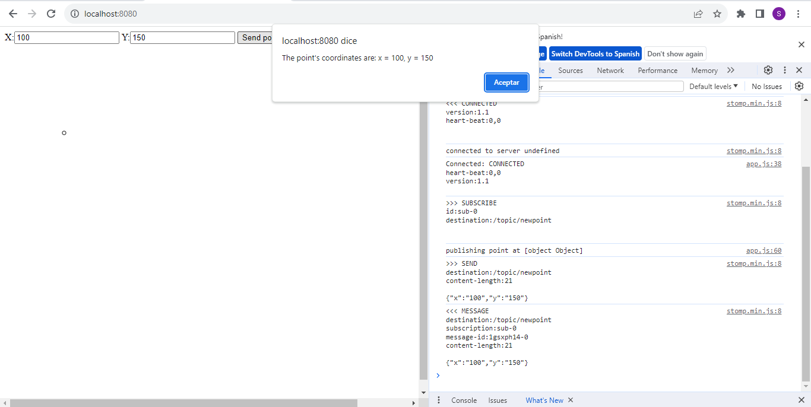  

3. __Compile y ejecute su aplicación. Abra la aplicación en varias pestañas diferentes (para evitar problemas con el caché del navegador, use el modo 'incógnito' en cada prueba).__  
	Se abre en 4 pestañas la aplicación:
	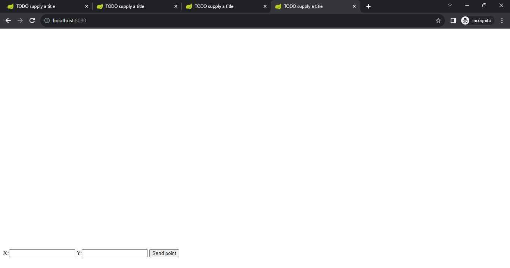  

4. __Ingrese los datos, ejecute la acción del botón, y verifique que en todas la pestañas se haya lanzado la alerta con los datos ingresados.__
	Pestaña 1 en la que se envió el punto:  
	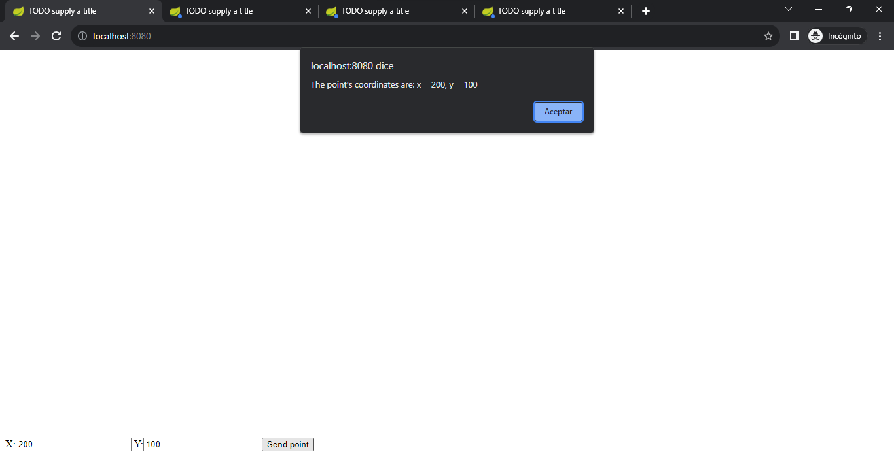  
	Pestaña 2:  
	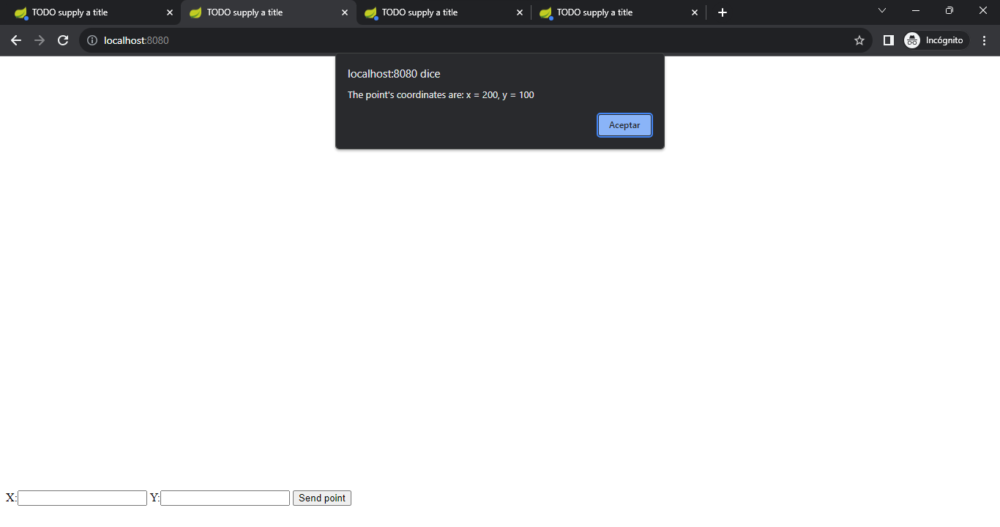  
	Pestaña 3:  
	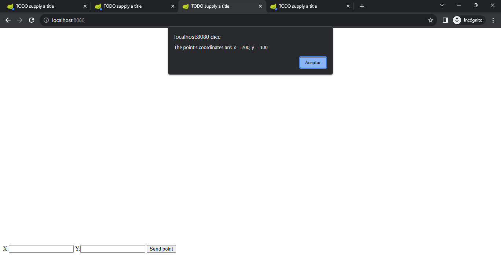  
	Pestaña 4:  
	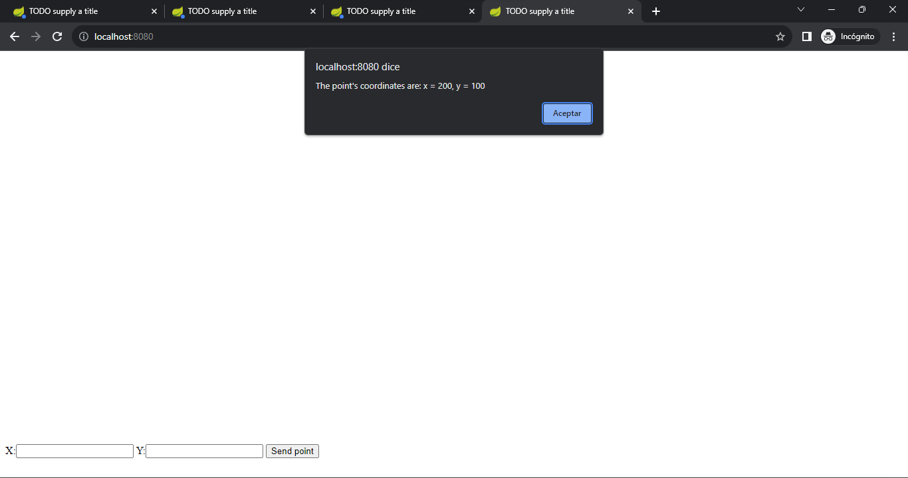  

5. __Haga commit de lo realizado, para demarcar el avance de la parte 2.__  

	```bash
	git commit -m "PARTE 1".
	```
	Commit:  
	

## Parte II.

__Para hacer más útil la aplicación, en lugar de capturar las coordenadas con campos de formulario, las va a capturar a través de eventos sobre un elemento de tipo \<canvas>. De la misma manera, en lugar de simplemente mostrar las coordenadas enviadas en los eventos a través de 'alertas', va a dibujar dichos puntos en el mismo canvas. Haga uso del mecanismo de captura de eventos de mouse/táctil usado en ejercicios anteriores con este fin.__

1. __Haga que el 'callback' asociado al tópico /topic/newpoint en lugar de mostrar una alerta, dibuje un punto en el canvas en las coordenadas enviadas con los eventos recibidos. Para esto puede [dibujar un círculo de radio 1](http://www.w3schools.com/html/html5_canvas.asp).__  
	Se implementa en el código.

2. __Ejecute su aplicación en varios navegadores (y si puede en varios computadores, accediendo a la aplicación mendiante la IP donde corre el servidor). Compruebe que a medida que se dibuja un punto, el mismo es replicado en todas las instancias abiertas de la aplicación.__  
	Se abre la aplicación y se ve que no tiene ningún punto pintado:
	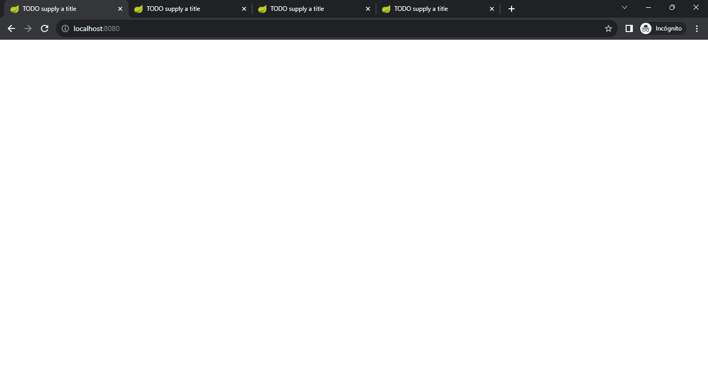  
	Al dar click en el canvas:  
	Pestaña 1 donde se dio click:  
	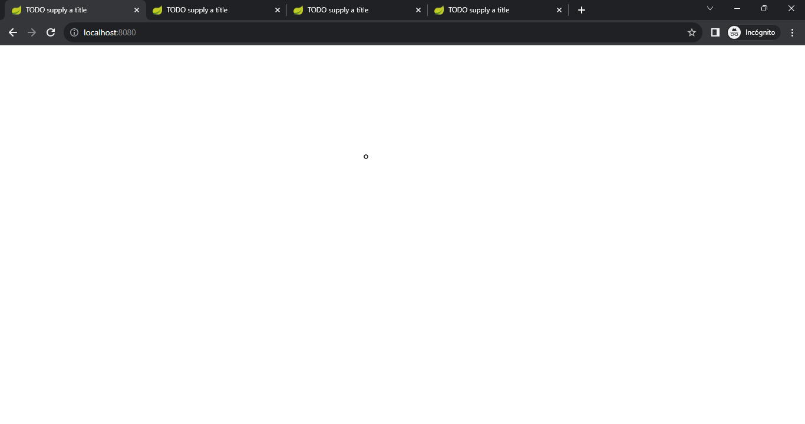  
	Pestaña 2:  
	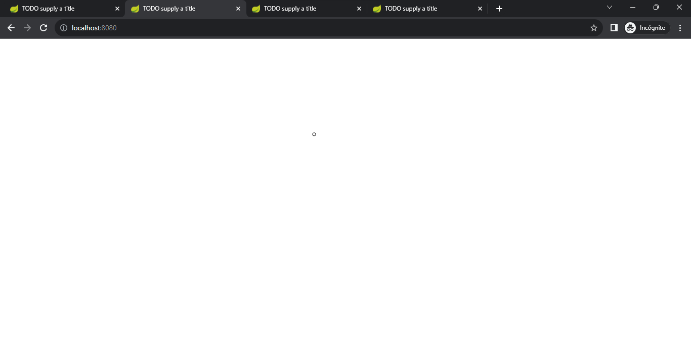  
	Pestaña 3:  
	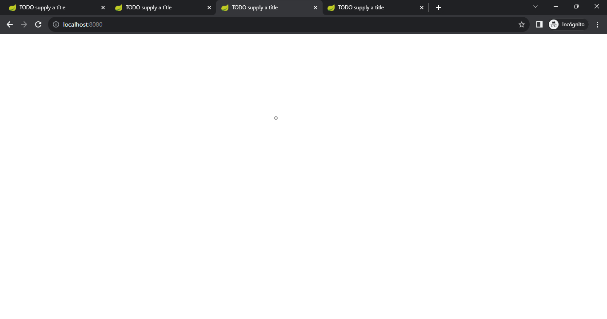  
	Pestaña 4:  
	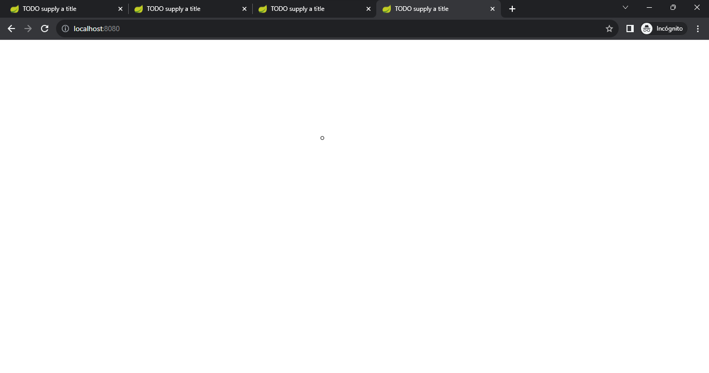  

3. __Haga commit de lo realizado, para marcar el avance de la parte 2.__

	```bash
	git commit -m "PARTE 2".
	```
	Commit:  
	

## Parte III.

__Ajuste la aplicación anterior para que pueda manejar más de un dibujo a la vez, manteniendo tópicos independientes. Para esto:__

1. __Agregue un campo en la vista, en el cual el usuario pueda ingresar un número. El número corresponderá al identificador del dibujo que se creará.__  
	Pantalla con el botón:  
	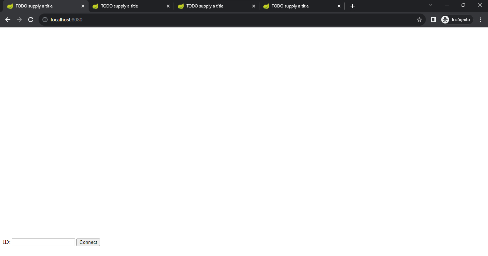  

2. __Modifique la aplicación para que, en lugar de conectarse y suscribirse automáticamente (en la función init()), lo haga a través de botón 'conectarse'. Éste, al oprimirse debe realizar la conexión y suscribir al cliente a un tópico que tenga un nombre dinámico, asociado el identificador ingresado, por ejemplo: /topic/newpoint.25, topic/newpoint.80, para los dibujos 25 y 80 respectivamente.__  
	Se implementó en el código.  
3. __De la misma manera, haga que las publicaciones se realicen al tópico asociado al identificador ingresado por el usuario.__
	Se implementó en el código.  
4. __Rectifique que se puedan realizar dos dibujos de forma independiente, cada uno de éstos entre dos o más clientes.__
	Se abren dos pestañas:  
	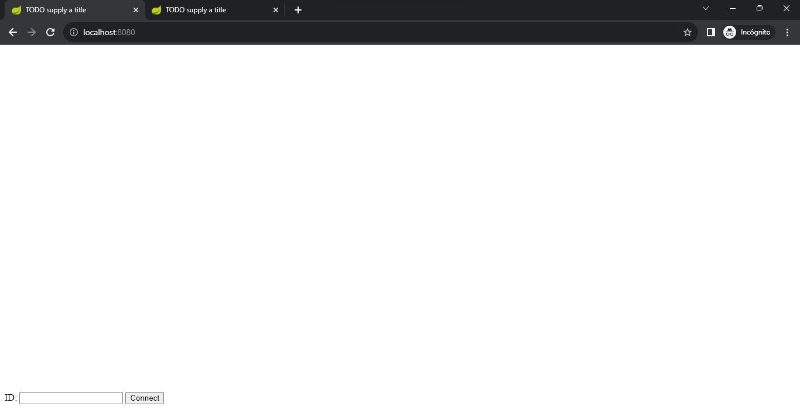  
	La primera se conecta en la mesa 1:
	  
	La segunda se conecta en la mesa 2:  
	  
 	En la mesa 1 se dibuja lo siguiente:  
	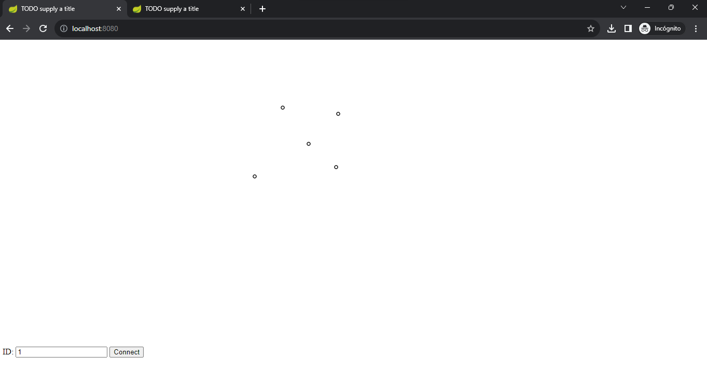  
	Mientras que en la mesa 2 no se dibujó nada:  
	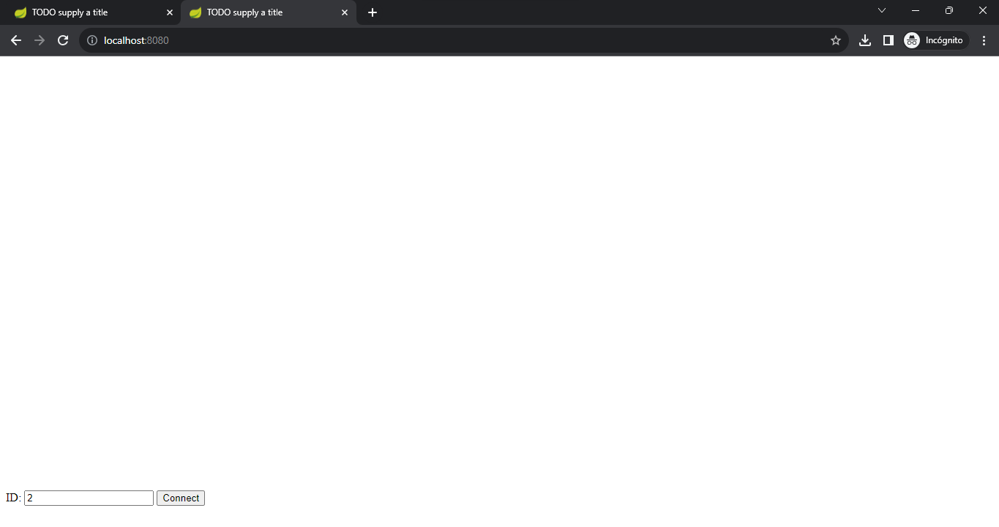  
	Luego en la mesa 2 se dibuja:  
	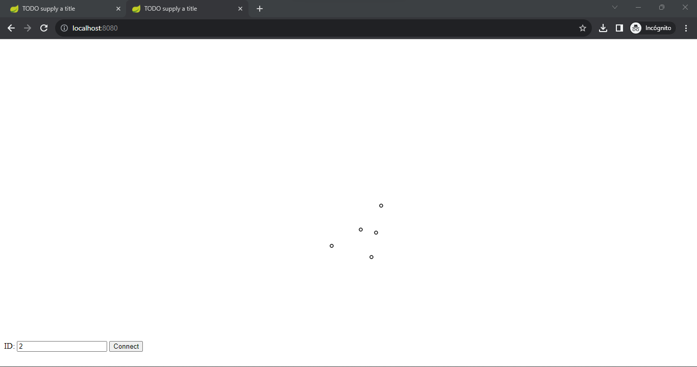  
	Y vemos que en la mesa 1 no se dibuja lo que se dibujó en la mesa 2:  
	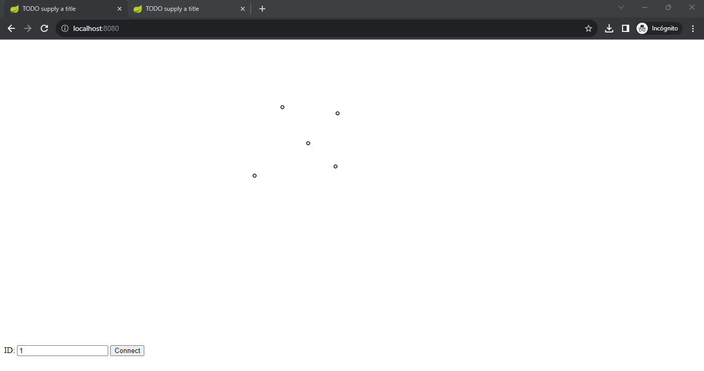  

	```bash
	git commit -m "PARTE 3".
	```
	Commit:  
	  

## Parte IV.

Para la parte IV, usted va a implementar una versión extendida del modelo de actividades y eventos anterior, en la que el servidor (que hasta ahora sólo fungía como Broker o MOM -Message Oriented Middleware-) se volverá también suscriptor de ciertos eventos, para a partir de los mismos agregar la funcionalidad de 'dibujo colaborativo de polígonos':


Para esto, se va a hacer una configuración alterna en la que, en lugar de que se propaguen los mensajes 'newpoint.{numdibujo}' entre todos los clientes, éstos sean recibidos y procesados primero por el servidor, de manera que se pueda decidir qué hacer con los mismos. 

Para ver cómo manejar esto desde el manejador de eventos STOMP del servidor, revise [puede revisar la documentación de Spring](https://docs.spring.io/spring/docs/current/spring-framework-reference/web.html#websocket-stomp-destination-separator).


1. __Cree una nueva clase que haga el papel de 'Controlador' para ciertos mensajes STOMP (en este caso, aquellos enviados a través de "/app/newpoint.{numdibujo}"). A este controlador se le inyectará un bean de tipo SimpMessagingTemplate, un Bean de Spring que permitirá publicar eventos en un determinado tópico. Por ahora, se definirá que cuando se intercepten los eventos enviados a "/app/newpoint.{numdibujo}" (que se supone deben incluir un punto), se mostrará por pantalla el punto recibido, y luego se procederá a reenviar el evento al tópico al cual están suscritos los clientes "/topic/newpoint".__

	```java
	
	@Controller
	public class STOMPMessagesHandler {
		
		@Autowired
		SimpMessagingTemplate msgt;
	    
		@MessageMapping("/newpoint.{numdibujo}")    
		public void handlePointEvent(Point pt,@DestinationVariable String numdibujo) throws Exception {
			System.out.println("Nuevo punto recibido en el servidor!:"+pt);
			msgt.convertAndSend("/topic/newpoint"+numdibujo, pt);
		}
	}

	```
 	Lo primero que realizamos fue agregar la siguiente línea a la clase de CollabPaintWebSocketConfig para permitir el uso de puntos como separador en los mensajes:  
	```java
 		config.setPathMatcher(new AntPathMatcher("."));
	```
	Y luego se crea la nueva clase requerida.   	

2. __Ajuste su cliente para que, en lugar de publicar los puntos en el tópico /topic/newpoint.{numdibujo}, lo haga en /app/newpoint.{numdibujo}. Ejecute de nuevo la aplicación y rectifique que funcione igual, pero ahora mostrando en el servidor los detalles de los puntos recibidos.__  
	Se cambia en el módulo de app.js y se prueba su funcionamiento, publicando estos dos puntos:  
	  
	Y viendo en el servidor se ven los dos puntos recibidos:  
	  	

3. __Una vez rectificado el funcionamiento, se quiere aprovechar este 'interceptor' de eventos para cambiar ligeramente la funcionalidad:__

	1. __Se va a manejar un nuevo tópico llamado '/topic/newpolygon.{numdibujo}', en donde el lugar de puntos, se recibirán objetos javascript que tengan como propiedad un conjunto de puntos.__  
   		Implementado en el código.  
	2. __El manejador de eventos de /app/newpoint.{numdibujo}, además de propagar los puntos a través del tópico '/topic/newpoints', llevará el control de los puntos recibidos(que podrán haber sido dibujados por diferentes clientes). Cuando se completen tres o más puntos, publicará el polígono en el tópico '/topic/newpolygon'. Recuerde que esto se realizará concurrentemente, de manera que REVISE LAS POSIBLES CONDICIONES DE CARRERA!. También tenga en cuenta que desde el manejador de eventos del servidor se tendrán N dibujos independientes!.__  
   		Implementado en el código.  
	3. __El cliente, ahora también se suscribirá al tópico '/topic/newpolygon'. El 'callback' asociado a la recepción de eventos en el mismo debe, con los datos recibidos, dibujar un polígono, [tal como se muestran en ese ejemplo](http://www.arungudelli.com/html5/html5-canvas-polygon/).__  
   		Implementado en el código.  
	4. __Verifique la funcionalidad: igual a la anterior, pero ahora dibujando polígonos cada vez que se agreguen cuatro puntos.__  
   		Se ingresa a la página con 2 clientes:  
   		En el primero ingresamos a la mesa 1 y ponemos 2 puntos, vemos, que no se unen:  
   		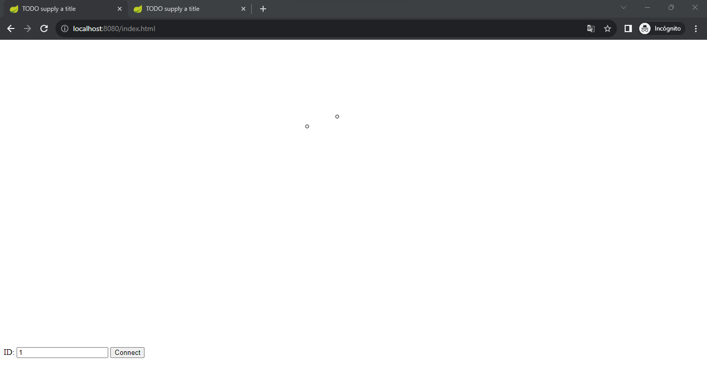  
   		Al agregar un tercer punto se crea el polígono:  
   		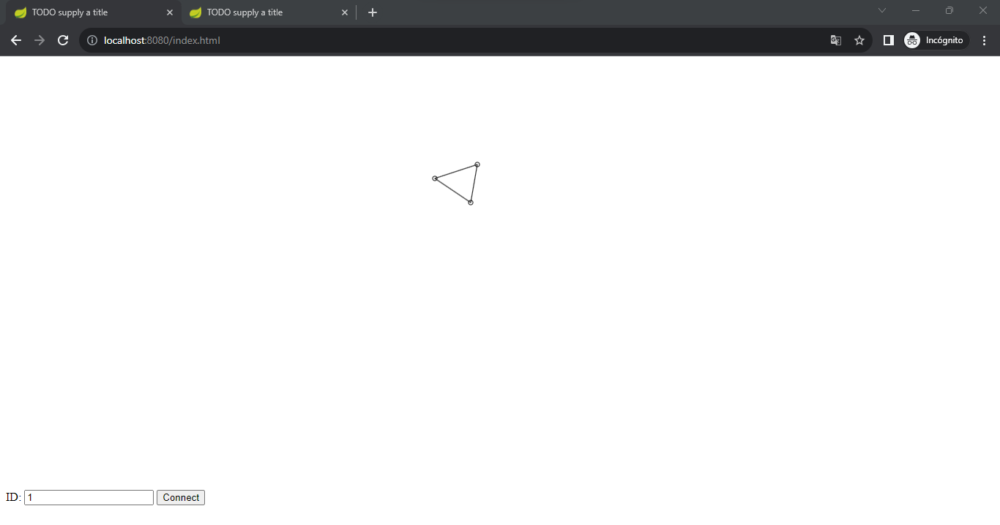  
   		Entramos desde el segundo cliente y agregamos un cuarto punto:  
   		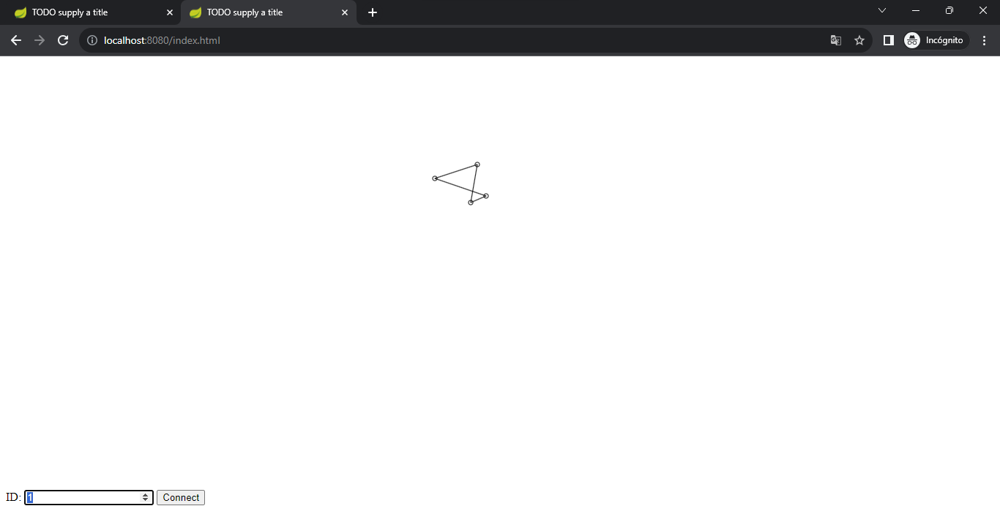  
   		Luego cambiamos de mesa en el primer cliente y hacemos otro polígono:  
   		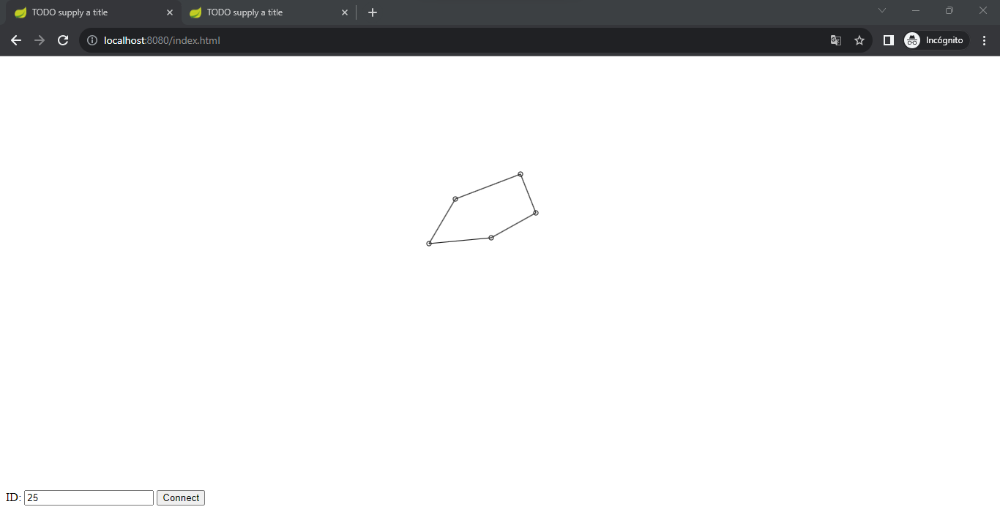  
   		Y vemos en el segundo cliente que no se cambió el dibujo:  
   		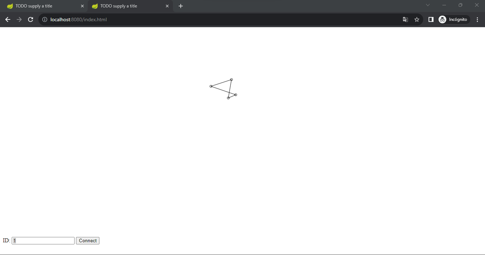
	
	
4. __A partir de los diagramas dados en el archivo ASTAH incluido, haga un nuevo diagrama de actividades correspondiente a lo realizado hasta este punto, teniendo en cuenta el detalle de que ahora se tendrán tópicos dinámicos para manejar diferentes dibujos simultáneamente.__  
	Se realizó la modificación en el diagrama entregado.  

5. __Haga commit de lo realizado.__  

	```bash
	git commit -m "PARTE FINAL".
	```
	Commit:
	

### Criterios de evaluación

1. La aplicación propaga correctamente los puntos entre todas las instancias abierta de la misma, cuando hay sólo un dibujo.
2. La aplicación propaga correctamente los puntos entre todas las instancias abierta de la misma, cuando hay más de un dibujo.
3. La aplicación propaga correctamente el evento de creación del polígono, cuando colaborativamente se insertan cuatro puntos.
4. La aplicación propaga correctamente el evento de creación del polígono, cuando colaborativamente se insertan cuatro puntos, con 2 o más dibujos simultáneamente.
5. En la implementación se tuvo en cuenta la naturaleza concurrente del ejercicio. Por ejemplo, si se mantiene el conjunto de los puntos recibidos en una colección, la misma debería ser de tipo concurrente (thread-safe).
